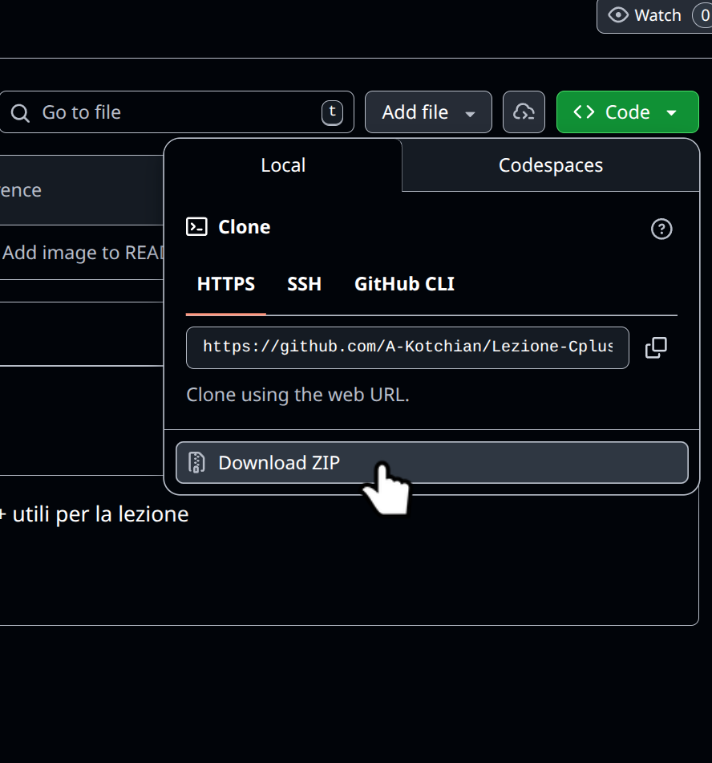
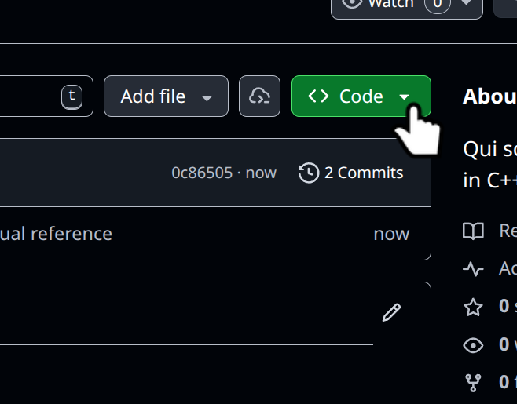

# Lezione-Cplusplus
Qui sono raggruppati tutti i programmi in C++ utili per la lezione. 

In "esempi.zip" troverete esempi con cui potete esercitarvi ed esercizi incentrati su:

- Esercizio 1: Introduzione a C++ e operazioni base
- Esercizio 2: Funzioni, For, While,If-else e Switch
- Esercizio 3: Struct, Array e Vector
- Esercizio 4: Puntatori, Array dinamici, Set e Passaggio per riferimento
- Esercizio 5: Numeri Pseudo-casuali e Gestione File
- Esercizio 6: Classi (WIP)

> [!TIP]
>  Per scaricare gli esempi:
>  
> 
> 
>

---

> [!NOTE]
> La repository è stata fatta velocemente e in pochi giorni quindi se ci sono errori oppure ce qualcosa incomprensibile, siete pregati di farlo presente
>  
> 

References:
-dispense-labinfI-parte2 dalle "Dispense di Laboratorio di Informatica II Parte A.A. 2025/26" di M.Baioletti 
